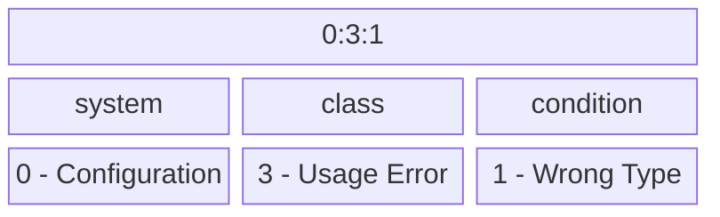

| id    | status   | title     | description                        | applies-to            |
|-------|----------|-----------|------------------------------------|-----------------------|
| CODES | APPROVED | Log Codes | Standardized code format for logs. | client-sdk,server-sdk |

**_See Also:_**

| Link                                       | Description          |
|--------------------------------------------|----------------------|
| [rfc9110](https://www.rfc-editor.org/rfc/rfc9110.html#name-status-codes) | Http Status Codes. |
| [ArcGIS Log Codes](https://enterprise.arcgis.com/en/server/latest/administer/windows/log-codes-overview.htm) | Log codes for ArcGIS |

# 1. Log Codes

## Introduction

The intent behind a log message is not always clear, and the language of log messages for equivalent scenarios can vary between different SDK implementations. When debugging a customer issue, this lack of consistency and clarity can increase the time needed to resolve the issue.

This specification seeks to improve this situation by providing:
- A standardized set of log codes that appear in log messages even if the associated log message changes over time.
- Templated standardized messages for text.
- Extended descriptions providing details beyond what is reasonable for a log message.
- A central location with log code information.
- A standardized data set which could be used for code generation.

## 1.1 Log Code Composition

Log codes are composed of 3 `specifiers` separated by a colon. The first specifier represents the affected `system` which categorizes the code by the components of the SDK in which the log condition occurs. The second specifier is the `class` of code this encodes the severity and type of action that may need to be taken. Lastly is the `condition`, which represents a specific condition within the specified system and class.



### Requirement 1.1.1

> Log codes *MUST* only contain ASCII numbers, and the colon character.

### Requirement 1.1.2

> Log codes *MUST* be composed of three `specifiers` separated by `:`.

### Requirement 1.1.3

> Log code `specifiers` *MUST* be composed of ASCII numbers.

Example `0:2:32` consists of the specifiers `0`, `2`, and `32`.

#### Requirement 1.1.3.1

> Log code `specifiers` *MUST* be assigned in a monotonically increasing manner.

### Requirement 1.1.4

> The first specifier of the log code, the `system` specifier, *MUST* define the system origin of the log message.
> - 0 - Configuration - Logs codes associated with SDK configuration.
> - 1 - LDClient - Logs associated with functionality of the client. Errors that could be covered by a more specific category, like "Evaluation" should be in that category.
> - 2 - Streaming - Logs associated with streaming LaunchDarkly payloads.
> - 3 - Polling - Logs associated with polling for LaunchDarkly payloads.
> - 4 - General Network - Logs associated with network failures. When possible use "Streaming", "Polling" or "Events" instead, or log both. For instance an event source may log a "General Network" condition and the streaming data source a "Streaming" condition.
> - 5 - Memory Store - Logs associated the in-memory store for flags/segments.
> - 6 - Persistent Store - Logs associated with persistent storage.
> - 7 - Evaluation - Logs associated with evaluation.
> - 8 - Events - Logs associated with events and event delivery.
> - 9 - Hooks - Logs associated with hooks.

### Requirement 1.1.5

> The second specifier of the log code, the `class` specifier, *MUST* define the class of the code.
> - 0 - Debug message: Message used for debugging.
> - 1 - Informative: An informative message logged during normal operation.
> - 2 - Usage Warning: A warning about the usage of an API or configuration. The usage or configuration does not interfere with operation, but is not recommended or may result in unexpected behavior. Setting the timeout for identification too high.
> - 3 - Usage Error: An error which represents a mis-use of an API and impedes correct functionality.
> - 4 - Runtime Warning: An unexpected, but recoverable, runtime issue not associated with usage.
> - 5 - Runtime Error: A non-usage error which interferes with operation and likely requires user intervention.
> - 6 - Implementation Error: An error that should not happen in correctly implemented code. For instance a missing condition in a case.

### Requirement 1.1.6

> The third specifier of the log code, the `condition` specifier, *MUST* represent a unique condition within the specifiers prefixing it.

For instance, in the codes `3:0:1` and `3:8:1` the `1` doesn't have to be unique between all components and systems, but there should only be a single definition of `3:0:1` representing a specific error with configuration.

This specification does not specify any condition specifiers.

## 1.2 Log Code Metadata

### Requirement 1.2.1

> The each log code specifier *MUST* have an associated name composed of ASCII letters. The name should avoid commonly used language keywords.

This name should be usable in generated code as function/class names.

Example:

Class Specifier - 3 - Name: "usageError"

System Specifier - 0 - Name: "configuration"

Code Specifier - 1 - Name: "wrongType"

These could be used in generated code to generate a scoped function.

```typescript
LogMessages.UsageError.Configuration.wrongType(...);
```

### Requirement 1.2.1.1

> The `condition` name *MUST* be unique.

### Requirement 1.2.2

> The `condition` *MUST* have an associated description.

This is not the text that should appear in a log, but instead a description of the purpose of the log message. What is the condition under which this message should be logged. Are there any additional remediation steps that should be associated with the log to improve the speed of debugging and support.

### Requirement 1.2.3

> The `condition` *MUST* have an associated parameterized string.

### Requirement 1.2.3.1

> The parameterized string *MUST* support substitution tokens. The tokens are in the form of `${name}` where `name` represents the parameter to substitute.

Example:
`Config option "${name}" should be of type ${expectedType}, but received ${actualType}, using the default value (${defaultValue}).`

This is a parameterized string with parameters of `name`, `expectedType`, and `actualType`.

Given:
- name: `sendEvents`
- expectedType: `boolean`
- actualType: `string`
- defaultValue: `true`

It would be logged as:
`Config option "sendEvents" should be of type boolean, but received string, using the default value (true).`

### Requirement 1.2.4

> Parameter definitions *MUST* be provided for parameters used in the format string. The definition should include the name of the parameter and an informative description.

Example:

Parameterized string:

`A streaming connection to LaunchDarkly has not been established within ${logDataSourceOutageAsErrorAfter} minutes after the connection was interrupted. The following errors were encountered: ${errorList}`

Parameter definitions:

logDataSourceOutageAsErrorAfter: `The duration, in minutes, of the logDataSourceOutageAsErrorAfter setting.`

errorList: `A list of the errors encountered. This list should be in the format of '${errorKind} (${kindCount} times)' separated by commas. The 'errorKind' should be one of the data source errors. Example "NETWORK_ERROR (6 times), ERROR_RESPONSE (3 times)"`


In this example the parameterized string cannot define the format of the error list, so the description is used to provide that information.

### Requirement 1.2.5

> The meta data *MUST* support an optional `deprecated` boolean field for `conditions`. When this field is `true` the message should not be actively used in new development and should be removed from existing SDKs over time.

#### Requirement 1.2.5.1

> The meta data *MUST* support an optional `deprecated reason` text field for `conditions`. This field should be present when `deprecated` is true and explain the reason for the deprecation.

### Requirement 1.2.6

> The meta data *MUST* support an optional `superseded` `log code` field for `conditions`. When the field is set to a log code, that code should be used instead. New SDK development should not use the code and existing SDKs should be updated to use the new code.

This is a full log code, not a specifier within the same class. This is because the superseding code could be a different class and/or system.

#### Requirement 1.2.6.1

> The meta data *MUST* support an optional `superseded reason` text field for `conditions`. This field should be present when `superseded` is set and explains the reason the code has been superseded.

### Requirement 1.2.7

> The `class` **MUST** have an associated description detailing the purpose of the class.

For example, the description of the "usageError" class could be:
`An error which represents a mis-use of an API and impedes correct functionality.`

### Requirement 1.2.8

The `system` **MUST** have an associated description explaining the type of `conditions` that should be associated with it.

For example, the description of the "configuration" system could be:
`Conditions associated with SDK configuration.`


## 1.3 Log Code Usage

### Requirement 1.3.1

> Log codes *MUST* be at the start of the log message, but after any log prefixes/tags.

For example, a logger may output in the format of `[LaunchDarkly.Streaming] This is the message.`
After adding log code support the message will be output as `[LaunchDarkly.Streaming] S0:2:1 This is the message.`

In systems with a customizable logger the code must be inserted into the string component of the log message and not as an additional field. If the message is an additional field, then it is likely the code will be omitted from customer logs. Additionally, the log code is not intended to be programmatically acted on, though it could be used for log filtering.

## 1.4 Log Code JSON Representation

The log codes and associated meta-data will be stored using a JSON representation. This JSON representation can be directly used by SDKs, or it can be used in code generation. The JSON format is specified using JSON schema.

| Schema specification                  |
|---------------------------------------|
| v1.0 [ld_log_codes](v1.0/ld_log_codes.json) |

Sample:
```json
{
  "systems": {
    "configuration": {
      "specifier": 0,
      "description": "Conditions associated with SDK configuration."
    }
  },
  "classes": {
    "usageError": {
      "specifier": 3,
      "description": "An error which represents a mis-use of an API and impedes correct functionality."
    }
  },
  "conditions": {
    "0:3:1": {
      "name": "wrongType",
      "specifier": 1,
      "class": 3,
      "system": 0,
      "description": "This message indicates that a configuration option was not of the correct type. This primarily applies to languages that are not strongly typed.",
      "message": {
        "parameterized": "Config option \"${name}\" should be of type ${expectedType}, but received ${actualType}, using the default value (${defaultValue}).",
        "parameters": {
          "name": "The name of the configuration option.",
          "expectedType": "The correct type for the configuration option.",
          "actualType": "The incorrect types used for the configuration option.",
          "defaultValue": "The default value of the configuration option."
        }
      }
    },
    "0:3:2": {
      "name": "unknownOption",
      "specifier": 2,
      "class": 3,
      "system": 0,
      "description": "This message indicates that an unrecognized configuration option was provided. This primarily applied to languages that are not strongly typed.",
      "message": {
        "parameterized": "Ignoring unknown config option \"${name}\"",
        "parameters": {
          "name": "The option that was not recognized."
        }
      }
    }
  }
}
```

## 1.5 Log Code Management

### Requirement 1.5.1

> The log code JSON *MUST* be stored in the `sdk-logs` repository.

### Requirement 1.5.2

> Updates to the log code JSON *MUST* be done via a pull request.

### Requirement 1.5.3

> The assignment of new specifiers *MUST* be done via a tool also maintained in the `sdk-logs` repository.

## 1.6 Log Code Tool

### Requirement 1.6.1

> The log code tool *MUST* be able to assign new specifiers for `systems` and update the log definition JSON file to include the new specifier.

### Requirement 1.6.2

> The log code tool *MUST* be able to assign new specifiers for `classes` and update the log definition JSON file to include the new specifier.

### Requirement 1.6.3

> The log code tool *MUST* be able to assign new specifiers for `conditions` and update the log definition JSON file to include the new specifier.

### Requirement 1.6.4

> The log code tool *MUST* be able to assign all specified meta-data required for newly created specifiers of any type.
