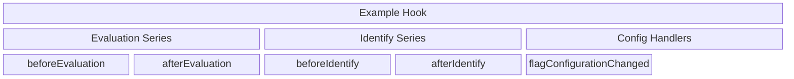
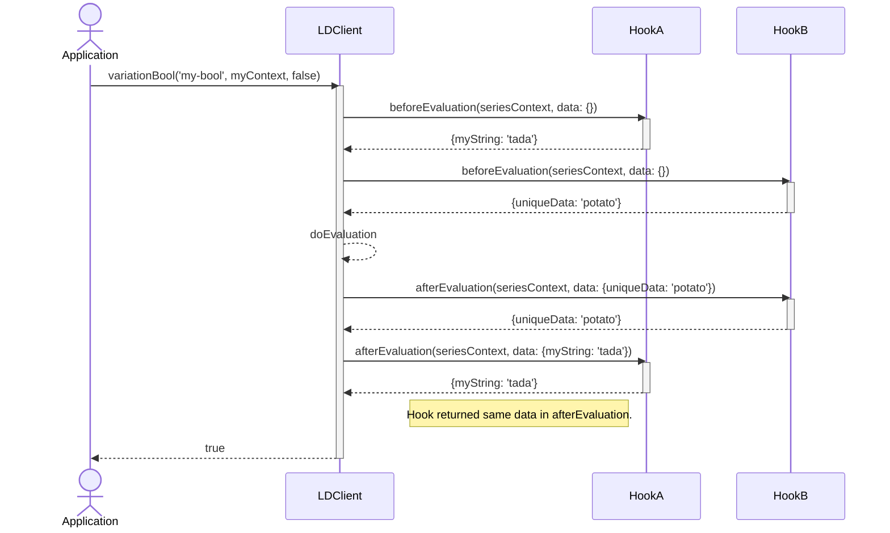

| id    | status    | title | description                                 | applies-to             |
|-------|-----------|-------|---------------------------------------------|------------------------|
| HOOK  | ACCEPTED  | Hooks | Specification of hooks and their lifecycle. | server-sdk, client-sdk |

**_See Also:_**

| Link                                       | Description          |
|--------------------------------------------|----------------------|
| [OpenFeature Hooks](https://github.com/open-feature/spec/blob/main/specification/sections/04-hooks.md) | OpenFeature hooks specification. |
| [Inspection Interfaces](https://docs.launchdarkly.com/sdk/features/inspectors) | Inspection interfaces. |

# 1. Hooks

## Introduction

`Hooks` provide entry points to observe or modify aspects of SDK operation. They are similar to middleware in some frameworks.
The initial implementation of hooks will be limited to observation use cases only, but the concept of mutable hooks should be considered for future applications.

`Hooks` are being developed primarily to support observability use cases, such as:
- Surfacing telemetry data
- Logging/Reporting errors

In the future, `Hooks` may be extended to mutable cases, such as decorating contexts on a per-evaluation basis.

`Hooks` add their logic at different points of execution called `stages` or `handlers`.

A hypothetical hook that supports an evaluation series, identify series, as well as a handler for flag configuration changing:


## Definitions

Hook: A collection of logic provided by either an application author or package external to the SDK. It contains methods that execute at specific points during SDK operations.

Stage: A function implemented as part of a hook that executes at specific points during application-initiated SDK operations. Examples of those SDK operations include: Variation methods, identify methods, flush, and accessing a data source or store during an evaluation.

Handler: A function that executes based on internal SDK operations. In contrast to the operations associated with stages, these operations are not directly triggered by an application. Examples: Background event flushing, stream or polling status, and flag updates.

Series: A series is an associated collection of stages. All stages associated with `variation` methods would be a series.

Context: The collection of information propagated to a stage or handler. Unrelated stage/handler types should use different context types. For instance, the evaluation series uses `EvaluationSeriesContext`.

SeriesData: Data propagated between stages of the same series for a hook on a per-invocation basis. SeriesData is not mutable, but each `stage` in a `series` can return new SeriesData.

Example of using series data:
```typescript
  beforeEvaluation?(seriesContext: EvaluationSeriesContext, data: EvaluationSeriesData): EvaluationSeriesData {
    const span = this.tracer.startSpan(seriesContext.method, undefined, context.active());
    span.setAttribute('feature_flag.context.key', canonicalKey);

    return { ...data, span };
  }
  afterEvaluation?(
    _seriesContext: EvaluationSeriesContext,
    data: EvaluationSeriesData,
    _detail: LDEvaluationDetail,
  ): EvaluationSeriesData {
    (data as SpanTraceData).span?.end();
    return data;
  }
```

## 1.1 Hook Implementation

### Requirement 1.1.1

> A hook **SHOULD** be implemented using interfaces or base classes for languages with object oriented capabilities.

An interface should only be used if the language supports optional methods or default method implementations. Extending an interface is typically a breaking change because implementations must implement the new methods to compile.

When using a base class, functions should be non-abstract and contain default operations that take no action.

Alternate implementations may be possible using language-appropriate techniques.

### Requirement 1.1.2

> A hook **MUST** be forward compatible with SDK versions, while allowing the addition of new stages and handlers.

If the SDK adds a new stage or handler, then existing hooks should continue to compile without modification. The maintenance of an ABI is not part of this specification.

For example, if hooks were extended with an `errorEvaluation` stage, then existing hooks should continue to compile and work with new SDK versions that incorporate the `errorEvaluation` stage.

### Requirement 1.1.3

> A hook **MUST** provide a `getMetadata` method. It has no parameters and returns a `HookMetadata`.

The metadata returned should always contain the same fields. If the language has an idiomatic mechanism for accessing data, for instance, properties, then that mechanism may be used instead of a function with the name `getMetadata`.

```typescript
  getMetadata(): HookMetadata {
    return {
      name: 'LaunchDarkly Tracing Hook',
    };
  }
```

### Types

#### HookMetadata

A data structure containing:
- name (string, readonly, required)

Care should be taken to ensure forward compatibility with the HookMetadata type. Similar to the base `Hook` implementation, it should either be a class in which default implementations may be provided or an interface with optional elements.

The `name` field will always be required as it is part of the initial specification version.

## 1.2 Evaluation Series

Hook stages that are executed during the execution of a variation method call.

### Requirement 1.2.1

> Hooks **MUST** support a `beforeEvaluation` stage. It accepts an `EvaluationSeriesContext` and `EvaluationSeriesData` and returns `EvaluationSeriesData`.

The `EvaluationSeriesData` input is unused for the `beforeEvaluation` stage, but it could be used if an additional stage was added that executes earlier in the series.

### Requirement 1.2.1.2

> The `beforeEvaluation` stage **MUST** be executed before the flag value has been determined. It **SHOULD** be executed as close as possible to the start of the `variation` method.

### Requirement 1.2.2

> Hooks **MUST** support an `afterEvaluation` stage.  It accepts an `EvaluationSeriesContext`, `EvaluationSeriesData` and an `EvaluationDetail` and returns `EvaluationSeriesData`.

The return value from `afterEvaluation` will be unused initially, but it could be used if an additional stage was added that executes later in the series.

### Requirement 1.2.2.2

> The `afterEvaluation` stage **MUST** be executed after the flag detail (EvaluationDetail) has been determined. It **SHOULD** be executed as close as possible to the end of the `variation` method.

The `EvaluationDetail` determined during flag evaluation is passed as the `EvaluationDetail` parameter to the stage.

### Requirement 1.2.2.3

> The `afterEvaluation` stage **MUST** be executed with the `EvaluationSeriesData` returned by the previous stage.

For example, an implementation may create an OpenTelemetry `span` in the `beforeEvaluation` stage and then close that
`span` in `afterEvaluation`. Propagating `EvaluationSeriesData` between the different stages provides a simple mechanism of handling per series invocations.

### Types

#### EvaluationSeriesContext

A data structure containing:
- flag key (string, readonly, required)
- context (LDContext, readonly, required)
- defaultValue (LDValue, readonly, required)
- method (string/enumeration, readonly, required): The method being executed, for instance `LDClient.variationBool`.
- environmentId (string, readonly, optional): The environment the SDK is connected to. This is provided by LaunchDarkly and only available once initialization has completed.

#### EvaluationSeriesData

A map that can be used to pass implementation-specific data between `stages` in the series. The map should be indexed by a `string` and allow any value type.

Example typings:
```typescript
ReadonlyMap<string, unknown>
```

```csharp
ImmutableDictionary<string, object>
```

EvaluationSeriesData should be immutable when possible. When it is not possible for the data to be immutable, the documentation should specify that the value should not be mutated.

EvaluationSeriesData should support being created based on existing data to simplify method implementation.

```csharp
public EvaluationSeriesData beforeEvaluation(EvaluationSeriesContext context, EvaluationSeriesData data) {
  /* generate some thing that is needed in afterEvaluation. */
  var builder = EvaluationSeriesData.builderOf(data);
  builder.setValue("my-data", myData);
  return builder.build();
}
```

#### Evaluation Detail

Each SDK should have an existing implementation of evaluation detail, which should be used with hooks.

## 1.3 Client Requirements

### Requirement 1.3.1

> The client **MUST** provide a mechanism of registering hooks during initialization of the client.

### Requirement 1.3.2

> The client **SHOULD** provide a mechanism of registering hooks after initialization of the client.

It is possible that adding hooks at runtime may incur too great of a cost for specific SDKs, so this requirement is optional but recommended.

### Requirement 1.3.3

> The client **SHOULD** execute stages/handler methods in-band with the function call that triggers the hook behavior.

For example, the stage would be executed synchronously on the thread of the variation call.

### Requirement 1.3.4

> The client **MUST** execute hooks in the following order:
>
> - beforeEvaluation: Executed in the order of hook registration.
> - afterEvaluation: Executed in reverse of the order of hook registration.

For example, given the initialization, `init('sdk-key', {hooks: new HookA(), new HookB()})`, for a given invocation:
- beforeEvaluation: HookA.beforeEvaluation, HookB.beforeEvaluation
- afterEvaluation: HookB.afterEvaluation, HookA.afterEvaluation
### Requirement 1.3.5

> The client **MUST** support idiomatic resource management patterns of the implementation technology.

For instance, the dotnet SDK should support (but not require) hooks that implement `IDisposable`. It should dispose of the hook when it will no longer be used.

### Requirement 1.3.6

> The client **MUST** support propagation of series data between stages in a series for a single invocation of the triggering method. Creating empty series data for the first stage, using the return from the first as input to the second, and repeated for each stage.

The data flows between `stages` on a per-hook basis. Each hook only has access to its own data. If you have hook A and hook B, then data is never passed from A to B or B to A. It flows from `A.beforeEvaluation` to `A.afterEvaluation`, and from `B.beforeEvaluation` to `B.afterEvaluation`.



### Requirement 1.3.7

> The client **MUST** handle exceptions which are thrown (or errors returned, if idiomatic for the language) during the execution of a `stage` or `handler` allowing operations to complete unaffected.

When performing evaluations, we want to ensure that those evaluations are always complete and do throw exceptions or return errors due to a hook. To that end, we should prevent errors from hooks from interfering with evaluations.

Exceptions or errors should be logged at the `error` level:
> [error] [hooks] During evaluation of flag "{flag-name}", stage "{stage}" of hook "{hook-name}" reported error: {error-message}

Example:
> [error] [hooks] During evaluation of flag "potato", stage "BeforeEvaluation" of hook "Test Hook" reported error: mashed is superior to baked

### Requirement 1.3.7.1

> When an error prevents a `stage` from returning `series data`, then the client should use the data from the previous successful stage, or empty data if there is no previous stage.

## 1.4 Identify Series

Hook stages that are executed during the execution of an identify method call as well as during initialization. This series currently applies to client-side SDKs only.

### Condition 1.4.1

The SDK is a client-side SDK.

#### Conditional Requirement 1.4.1.1

> Hooks **MUST** support a `beforeIdentify` stage. It accepts an `IdentifySeriesContext` and `IdentifySeriesData` and returns `IdentifySeriesData`.

The `IdentifySeriesData` input will be empty for `beforeIdentify` method call, but in the future, it could be populated by a preceding step.

#### Conditional Requirement 1.4.1.2

> The `beforeIdentify` stage **MUST** be executed at the start of the identification process before loading cached values or making any network calls associated with the identification process. It **SHOULD** be executed as close as possible to the start of the `identify` or initialization method.

#### Conditional Requirement 1.4.1.3

> Hooks **MUST** support an `afterIdentify` stage.  It accepts an `IdentifySeriesContext`, `IdentifySeriesData`, and a `IdentifyResult` and returns `IdentifySeriesData`.

The return value from `afterIdentify` will be unused initially, but it could be used if an additional stage was added that executes later in the series.

The `IdentifyResult` will contain the results of the identification process. This could include an indication of a successful identification process, terminal failure, or that the identification has been superseded. Not all SDKs will have the same possible status values.

#### Conditional Requirement 1.4.1.4

> The `afterIdentify` stage **MUST** be executed after the identification process completes. It **SHOULD** be executed as close as possible to the end of the identification process. If the `identify` or initialization method has a timeout, and the identification process continues after that timeout, then the `afterIdentify` is not called when the method times out.

It is possible for the `afterIdentify` method to never be called. Most errors encountered during identification are non-terminal, and the process continues to retry.

#### Conditional Requirement 1.4.1.5

> The `afterIdentify` stage **MUST** be executed with the `IdentifySeriesData` returned by the previous stage.

For example, an implementation may create an OpenTelemetry `span` in the `beforeIdentify` stage and then close that
`span` in `afterIdentify`. Propagating `IdentifySeriesData` between the different stages provides a simple mechanism of handling per series invocations.

### Types

#### IdentifySeriesContext

A data structure containing:
- context (LDContext, readonly, required)
- timeout (duration/number, readonly, optional) - The concrete type will be SDK dependent and could be a duration or a number in SDK specific units.
- environmentId (string, readonly, optional): The environment the SDK is connected to. This is provided by LaunchDarkly and only available once initialization has completed. For the first identification this would usually not be available until `afterIdentify`.


#### IdentifySeriesData

A map that can be used to pass implementation-specific data between `stages` in the series. The map should be indexed by a `string` and allow any value type.

Example typings:
```typescript
ReadonlyMap<string, unknown>
```

```csharp
ImmutableDictionary<string, object>
```

IdentifySeriesData should be immutable when possible. When it is not possible for the data to be immutable, the documentation should specify that the value should not be mutated.

IdentifySeriesData should support being created based on existing data to simplify method implementation.

```csharp
public IdentifySeriesData beforeEvaluation(IdentifySeriesContext context, IdentifySeriesData data) {
  /* generate some thing that is needed in afterEvaluation. */
  var builder = IdentifySeriesData.builderOf(data);
  builder.setValue("my-data", myData);
  return builder.build();
}
```

#### IdentifyResult

A data structure containing:
- status (enum, readonly, required)

Example status:
- Error - Identify failed.
- Shed - Superseded by a new identify.
- Success - Identify completed successfully.

## 1.5 Configuration Handlers

Handlers which are executed on SDK client configuration changes.

### Condition 1.5.1

The SDK is a client-side SDK.

#### Conditional Requirement 1.4.1.1

> Hooks **MUST** support a `flagConfigurationChanged` handler. It accepts `FlagConfiguration` and has no return value.

#### Conditional Requirement 1.4.1.2

> The `flagConfigurationChanged` handler must be invoked whenever there is a flag configuration change. The handler must be unconditionally invoked on any identify, patch, update or delete even if the evaluated flag value and associated details are the same.

### Types

#### FlagConfigurationDetails

A data structure containing:
- replace (boolean, readonly, required) - If present the associated flag details replace any existing flag detail.
- details (map, readonly, required) - A map of flag keys to an associated `LDEvaluationDetail`. The `LDEvaluationDetail` should be optional and an omitted value indicates that the flag was deleted.

### Examples

#### Replace existing flag configuration

##### FlagConfigurationDetails
```
{
  "replace": true,
  "details": {
    "flagA": {
      "reason": { "kind": 'RULE_MATCH', "ruleId": 'rule1', "ruleIndex": 0 },
      "value": false,
      "variationIndex": 1,
    },
    "flagB": {
      "reason": { "kind": 'FALLTHROUGH'},
      "value": true,
      "variationIndex": 0,
    }
  }
}
```
##### Explanation

Replace is true, so the current flag configuration consists only of "flagA" and "flagB". Any previous flag data is discarded.

#### Update a single flag

##### FlagConfigurationDetails
```
{
  "replace": false,
  "details": {
    "flagA": {
      "reason": { "kind": 'FALLTHROUGH' },
      "value": true,
      "variationIndex": 0,
    },
  }
}
```

##### Explanation

Replace is false, so this is an update of "flagA" with updated details. If "flagA" did not previously exist, then this represents the addition of a flag.

#### A single flag is deleted

##### FlagConfigurationDetails
```
{
  "replace": false,
  "details": {
    "flagA": null,
  }
}
```

##### Explanation

Replace is false, so this is an update of "flagA". The details are null, which indicates "flagA" has been deleted.

An SDK may use any optional type, but for a JSON representation `null` should be used, as `undefined` would not be serialized.

#### A flag is updated and a flag is deleted

##### FlagConfigurationDetails
```
{
  "replace": false,
  "details": {
    "flagB": null,
    "flagC": {
      "reason": { "kind": 'FALLTHROUGH' },
      "value": true,
      "variationIndex": 0,
    },

  }
}
```

##### Explanation

Replace is false, so this is an update of "flagB" and "flagC". "flagB" has been deleted, and "flagC" has been created or updated.
